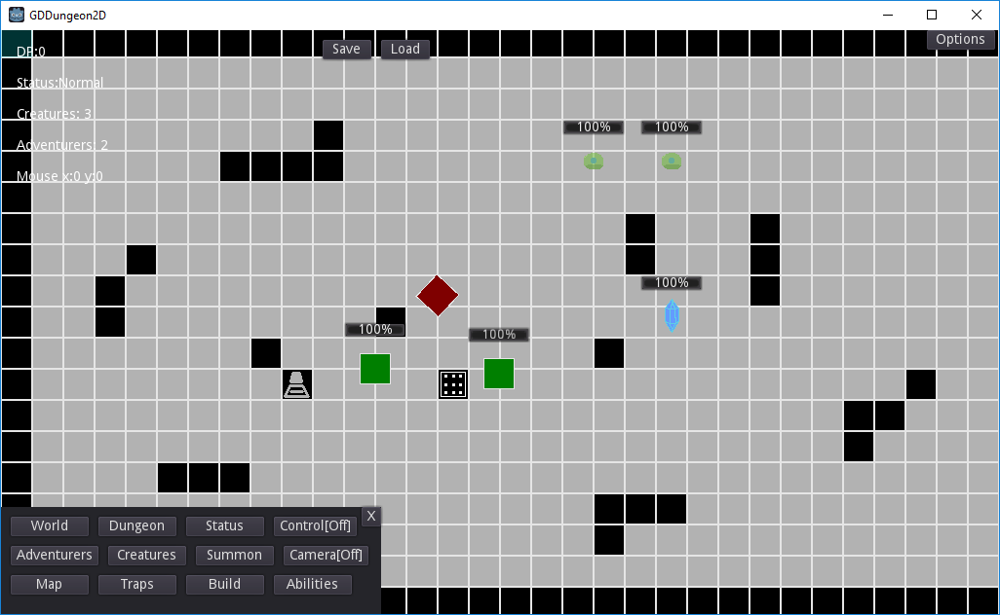

Project Name: GDDungeon2D

Created by: Lightnet

License: MIT

Game Engine: Godot 2.1.3

Information: Just simple dungeon core game idea. To defense dungeon core for being destroy and to survive to get stronger.

Notes:
 * Credits in the docs folder.
 * Resource files are place holder for prototyping builds.
 * There are multiple Licenses for content builds.
 
Credits to the Godot community which help find and learn to build the game.